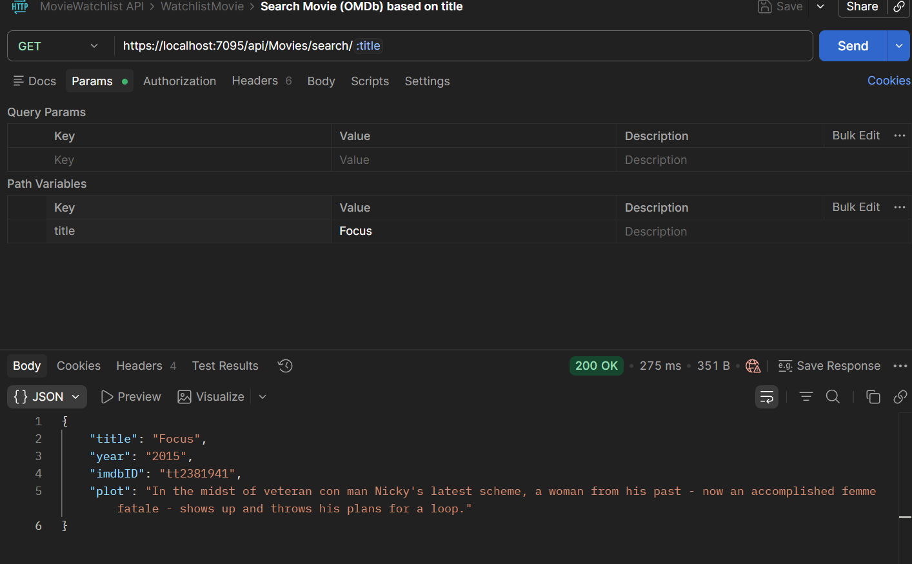
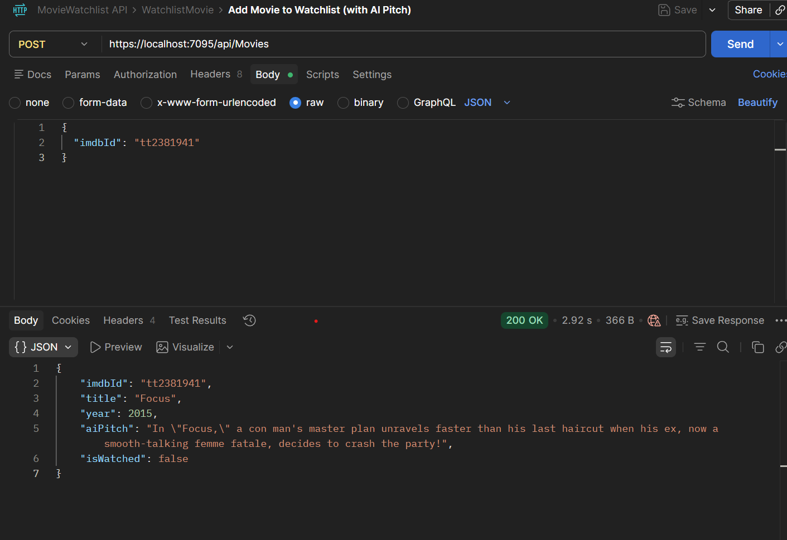
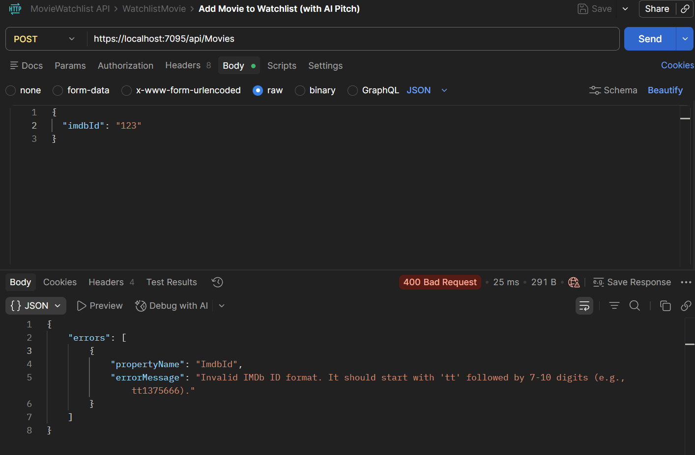
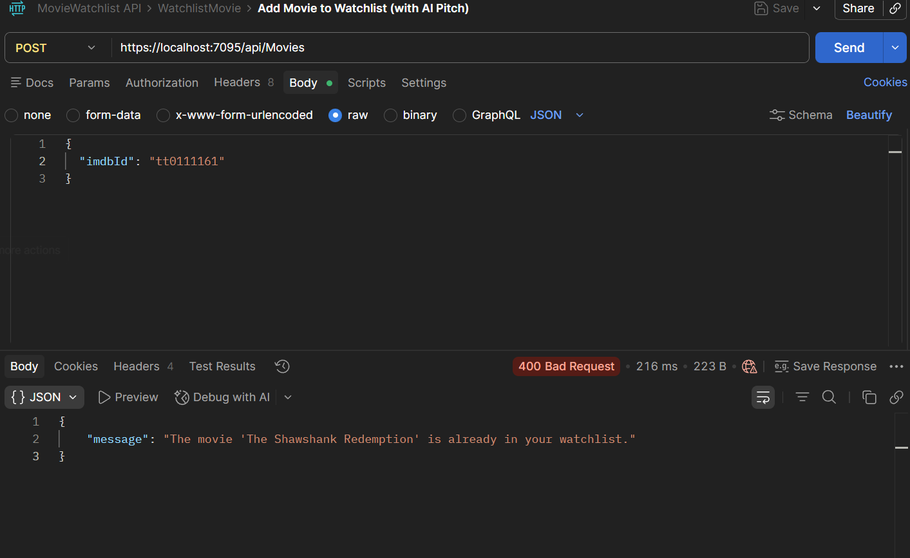

# Movie Watchlist API

A modern ASP.NET Core Web API that manages your movie watchlist with an AI twist.

## Features
- **External API Integration:** Fetches movie data from OMDb API using `HttpClient`.
- **AI Content Generation:** Uses OpenAI (`gpt-4o-mini`) to generate unique, funny one-sentence movie pitches.
- **Robust Validation:** Implements FluentValidation to ensure clean data input (e.g. IMDb ID format `tt1234567`).
- **Database Persistence:** SQL Server storage using Entity Framework Core.
- **DTOs:** Separate request/response models to keep the API clean and the internals hidden.

## Tech Stack
- .NET 9.0 / ASP.NET Core
- Entity Framework Core (SQL Server)
- FluentValidation
- OpenAI SDK
- Scalar (API documentation UI)

## Architecture
```
Controller → Service → External APIs (OMDb, OpenAI)
                    → Database (SQL Server via EF Core)
```

| Layer | Responsibility |
|-------|---------------|
| `MoviesController` | Handles HTTP requests, validation, error responses |
| `MovieService` | Business logic, OMDb calls, database operations |
| `OpenAiService` | Generates AI movie pitches via OpenAI |
| `AppDbContext` | Entity Framework Core database context |

## Endpoints

| Method | Route | Description |
|--------|-------|-------------|
| `GET` | `/api/movies/search/{title}` | Search OMDb for a movie by title |
| `GET` | `/api/movies` | Get all movies in your watchlist |
| `POST` | `/api/movies` | Add a movie by IMDb ID (generates AI pitch) |
| `PUT` | `/api/movies/{id}/watched` | Mark a movie as watched |
| `DELETE` | `/api/movies/{id}` | Remove a movie from the watchlist |

## Screenshots

### 1. Search OMDb by Title


### 2. Add Movie with AI Pitch


### 3. Validation Error (Invalid IMDb ID)


### 4. Duplicate Movie Error


## Testing & Debugging
- **Manual Integration Testing:** Using Scalar and Postman to trigger full flows from request to database.
- **Validation Testing:** Confirmed that invalid IMDb IDs are blocked before reaching the service layer.
- **Visual Studio Debugging:** Used breakpoints to monitor the data flow between OMDb responses and the OpenAI prompt construction.
- **Postman Collection:** Included in `Docs/MovieWatchlist API.postman_collection.json` with all 5 endpoints pre-configured.

## Setup

1. **Database** - Either run the `Docs/DatabaseSetup.sql` script in SQL Server, or use EF Core migrations:
   ```bash
   dotnet ef database update
   ```

2. **API Keys** - Add your keys using User Secrets:
   ```bash
   dotnet user-secrets set "OMDb:ApiKey" "your-omdb-key"
   dotnet user-secrets set "OpenAI:ApiKey" "your-openai-key"
   ```

3. **Run:**
   ```bash
   dotnet run
   ```
   The API will be available at `https://localhost:7095`. Open `/scalar/v1` for the interactive API docs.
